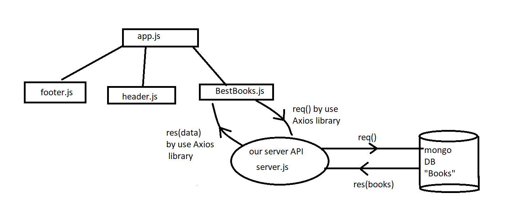
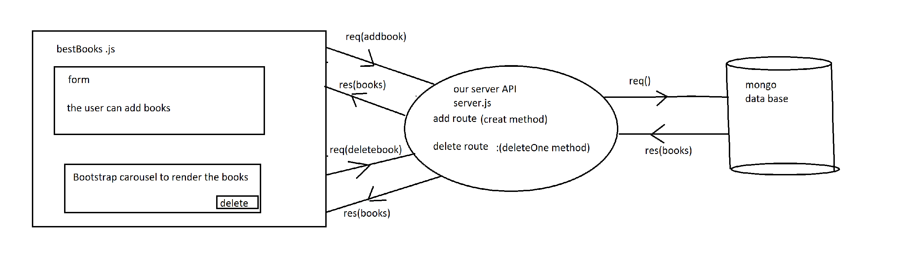

# Project Name

**Author**: Walaa' Atiyh & Amani Al-Zoube
**Version**: 1.0.0 (increment the patch/fix version number if you make more commits past your first submission)

## Overview
<!-- Provide a high level overview of what this application is and why you are building it, beyond the fact that it's an assignment for this class. (i.e. What's your problem domain?) -->

## Getting Started

**Backend side**

   #### lab 11 
   1- ceate server

  2- Create a data base
   * add mongoose to my server  [source!](https://mongoosejs.com/docs/)
   *  npm i mongoose --save
   *  creat schema &model in other file then requiring in app.js

   * seed your database "insert initial data "
   *  creat books route to get the request and send the response to the user "front end" using json formate

 3- Createt the front end
   * use a Bootstrap carousel to render all the books returned.
   
4- Make the server be able to send request to the data base
Createt the front end
5- send request to the server (get method)
#### lab 12:
1- deploy a data base by use "Mongodb Atlas" add,delete ,get data from it

1- front end 
* add navigate between Home and About "pages".
* creat modale for adding book 
* delete butten 
* use post method to add book and delete method to delete it 
3- backend 
*  creat books route for add and another route for delete 

## Architecture
### lab 11:

### lab 12:

## Change Log
4/9/2022 lab 11 :

the application have mongo data base with initial data.render all the books returned using slides.

5/9/2022 lab 12:
The user can add a book in the database or delete it .

## Estimates
<!-- See below -->

## Credit and Collaborations
my partner is Amani ALZoubi , we build the workflow

## Time Estimates

**lab 11 at 4/9/2022**

Name of feature: READ of CRUD

Estimate of time needed to complete: 5hours

Start time: 3.00pm sunday

Finish time: 1.51 am monday

Actual time needed to complete: 8 hours

**lab 12 at 5/9/2022**

Name of feature: READ of CRUD

Estimate of time needed to complete: 10hours

Start time: 8.00pm monday

Finish time: 3.30am tusday

Actual time needed to complete: 10 hours